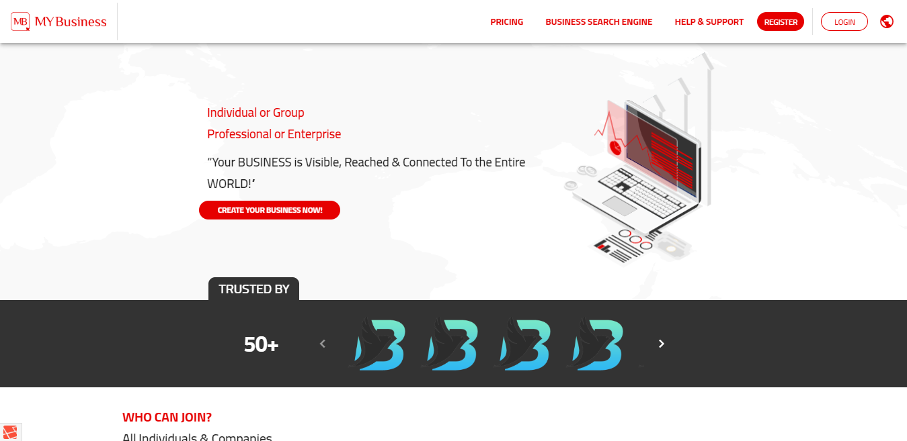
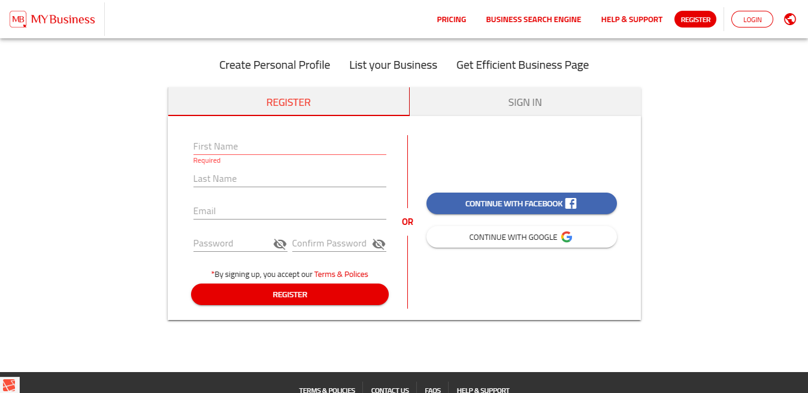
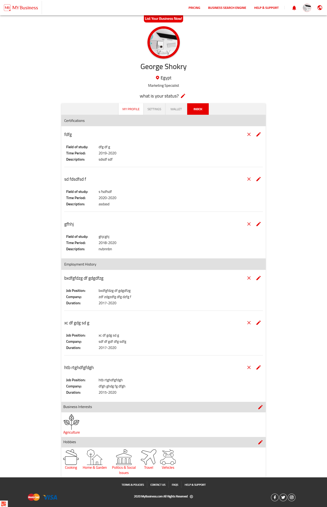
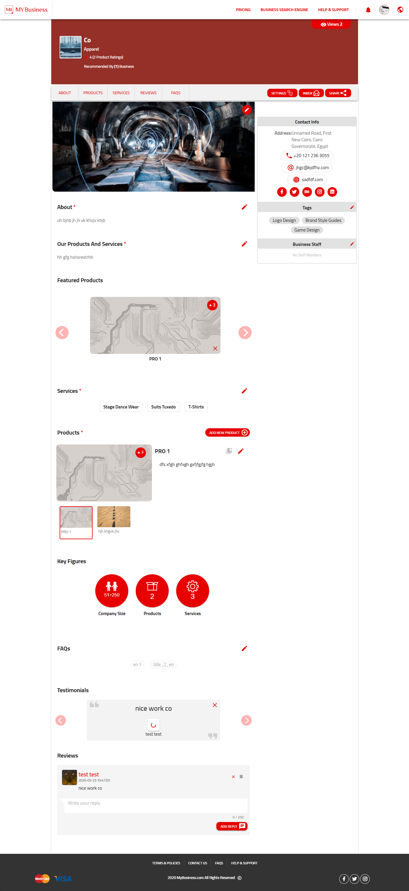
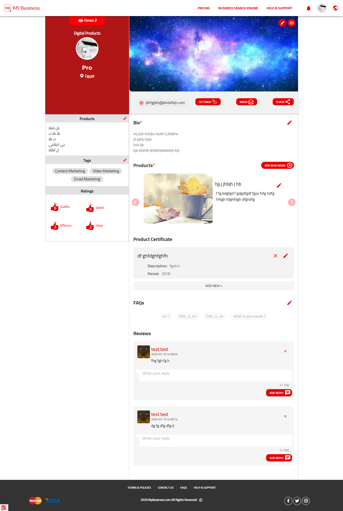
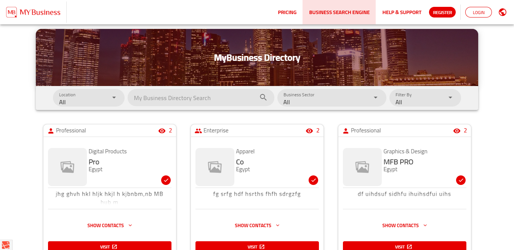
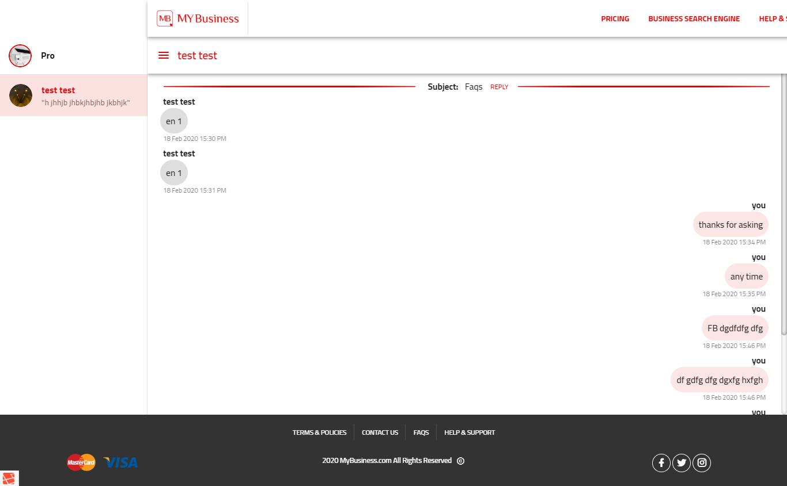

# business-project
 ##### the front end part of a SPA business project using Vue.js.
 ##### the project did not published yet.

### Tools and components Used
 - [Vue.js v2.6.11](https://vuejs.org/)
 - [Vuetify v2.2.15](https://vuetifyjs.com/en/)
 - [moment.js](https://momentjs.com/)
 - [vue-i18n](https://kazupon.github.io/vue-i18n/)
 - vue-router & vuex
 and more custom components.
 

## Screens

-

-

-

-

-

-

#### all these pages are full responsive.
### NOTE: And these are not all of screens.
